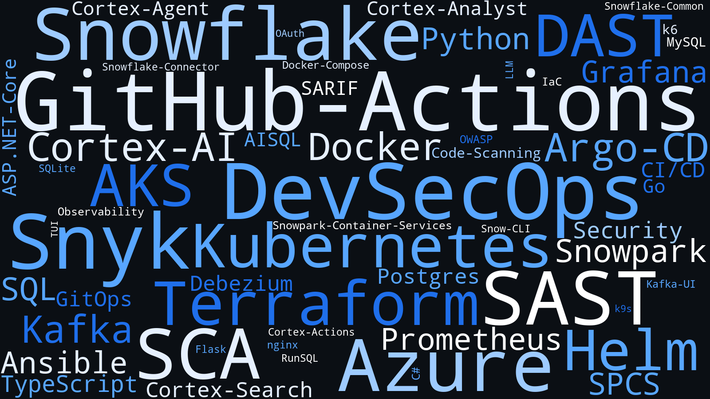

# Marcelino’s OSS Public Portfolio

This workspace curates my published OSS projects across Azure infrastructure, DevSecOps pipelines, Snowflake GitHub Actions, and Snowflake labs/tools—with room for additional stacks as they go public.

Current highlights:

- **Azure** – a complete AKS GitOps reference implementation that spans Terraform, Helm, Argo CD, Ansible, Prometheus/Grafana, and k6.
- **DevSecOps CDC demo** – a local MySQL → Kafka (Debezium) → Postgres pipeline with Docker Compose, Kafka UI visibility, and seed data for validation.
- **DevSecOps Security demo** – SAST/SCA, SCAScan (Trivy SBOM), and DAST (OWASP ZAP) pipelines, manual-only for demo control.
- **AIML RAG Ops Lab** – a local LangGraph + Ollama + Chroma RAG lab with ingest, inspect, and chat workflows, CSV/JSON ingestion, source inventory reports, evals, and updated architecture diagrams.
- **Snowflake GitHub Actions** – a family of GitHub Actions, helper libraries, and testing harnesses that showcase Cortex AI integrations plus day‑to‑day operational tooling.
- **Snowflake labs and tooling** – Snowpark Container Services demos ([`Snowflake.SPCS.Lab`](https://github.com/marcelinojackson-org/Snowflake.SPCS.Lab)), the [`snow9s`](https://github.com/marcelinojackson-org/snow9s) k9s‑style TUI (services/pools/repos/instances), and a reserved IaC track ([`Snowflake.IAC`](https://github.com/marcelinojackson-org/Snowflake.IAC)) ready to house future assets.
- **DataOps dbt medallion demo** – a minimal dbt Core medallion sample (bronze/silver/gold) on messy HR data in Postgres + Docker.

This README is the top-level atlas. Each repository underneath ships with its own README for installation or usage details.

## Technology Word Cloud

## Portfolio map

### Azure

| Path | Focus | Highlights / Notes |
| --- | --- | --- |
| [`DataOps.dbtMedallionDemo`](https://github.com/marcelinojackson-org/DataOps.dbtMedallionDemo) | dbt medallion demo | Messy HR data, Postgres + Docker, bronze/silver/gold layers. |
| [`Azure.AKS.GitOps.Lab`](https://github.com/marcelinojackson-org/Azure.AKS.GitOps.Lab) | Azure Kubernetes Service GitOps lab | Terraform-based cluster bring-up, Helm workloads, Argo CD continuous sync, Ansible automation, observability stack, CLI playbooks, teardown tooling. |

### AIML / RAG

| Path | Focus | Highlights / Notes |
| --- | --- | --- |
| [`AIML.RAGOpsLab`](https://github.com/marcelinojackson-org/AIML.RAGOpsLab) | Local RAG lab | LangGraph + Ollama + Chroma pipeline with ingest, list/inspect (CSV/TSV + vectors), sources inventory, evals, and chat w/ citations. Supports CSV/JSON ingestion, configurable chunking + retrieval, and both flowchart + cross‑functional architecture diagrams. |

### DevSecOps

| Path | Focus | Highlights / Notes |
| --- | --- | --- |
| [`DevSecOps.CDCDemo`](https://github.com/marcelinojackson-org/DevSecOps.CDCDemo) | CDC pipeline demo | MySQL source with Debezium CDC into Kafka, JDBC sink into Postgres, Kafka UI for visibility, seeded datasets for quick validation. |
| [`DevSecOps.SecurityDemo`](https://github.com/marcelinojackson-org/DevSecOps.SecurityDemo) | Security pipeline demo | SAST + SCA (manual-only), SCAScan (Trivy SBOM), plus DAST (OWASP ZAP full scan) with artifacts, screenshots, and tuning rules. |

### Snowflake labs and tooling

| Path | Focus | Highlights / Notes |
| --- | --- | --- |
| [`Snowflake.SPCS.Lab`](https://github.com/marcelinojackson-org/Snowflake.SPCS.Lab) | Snowpark Container Services lab | Containerized ETL demo (`spcs-etl-job/`) with Python loader, Dockerfile, staged sample CSVs, and a job spec wired for Snow CLI + compute pools. |
| [`snow9s`](https://github.com/marcelinojackson-org/snow9s) | SPCS terminal dashboard | k9s-style TUI with Services/Pools/Repos/Instances views, command mode (`:`), fast keyboard navigation, live refresh, and config via `SNOWFLAKE_*` env vars or `~/.snow9s/config.yaml`. |
| [`Snowflake.IAC`](https://github.com/marcelinojackson-org/Snowflake.IAC) | Future infrastructure | Empty placeholder for eventual Snowflake IaC assets. |

### Snowflake GitHub Actions ([Medium Article](https://medium.com/@mjmarc.common/shipping-ai-powered-snowflake-workflows-with-github-actions-eeb3fe07a354))

| Path | Focus | Highlights / Notes |
| --- | --- | --- |
| [`Snowflake.Common`](https://github.com/marcelinojackson-org/Snowflake.Common) | Shared TypeScript library | Centralizes `SNOWFLAKE_*` validation, logging controls, and helper APIs (`getSnowflakeConnection`, `runSql`) consumed by every action. |
| [`Snowflake.Testing`](https://github.com/marcelinojackson-org/Snowflake.Testing) | Validation scripts | Cross-repo build/test harnesses that rebuild shared libraries, package actions, and run local Cortex smoke tests. |
| [`Snowflake.RunSQLAction`](https://github.com/marcelinojackson-org/Snowflake.RunSQLAction) | GitHub Action | Executes SQL end-to-end, applies safe limits, emits CSV/metadata artifacts for large result sets, and leans on the shared library for connectivity. |
| [`Snowflake.CortexAI.AgentAction`](https://github.com/marcelinojackson-org/Snowflake.CortexAI.AgentAction) | GitHub Action | Bridges GitHub Actions with Cortex Agents, streaming every event plus a final summary for downstream workflow steps. |
| [`Snowflake.CortexAI.AnalystAction`](https://github.com/marcelinojackson-org/Snowflake.CortexAI.AnalystAction) | GitHub Action | Connects to Cortex Analyst semantic models/views, exposes optional SQL echoing, and returns structured responses for analytics automation. |
| [`Snowflake.CortexAI.SearchAction`](https://github.com/marcelinojackson-org/Snowflake.CortexAI.SearchAction) | GitHub Action | Wraps the Cortex Search REST API with filters, pagination, rerankers, and scoring controls. |
| [`Snowflake.AISQLAction`](https://github.com/marcelinojackson-org/Snowflake.AISQLAction) | GitHub Action | Runs Cortex AISQL functions like `AI_COMPLETE`, `AI_EXTRACT`, `AI_SENTIMENT`, `AI_CLASSIFY`, `AI_COUNT_TOKENS`, `AI_EMBED`, `AI_SIMILARITY`, `AI_SUMMARIZE`, `AI_TRANSLATE`, and `AI_PARSE_DOCUMENT`. |

## [`Azure.AKS.GitOps.Lab`](https://github.com/marcelinojackson-org/Azure.AKS.GitOps.Lab)

I built this lab for repeatable cluster builds, controlled experiments, and demos:

- **Provisioning workflow** – Terraform modules carve out the resource group, networking, and AKS cluster. Targeted apply sequences are documented (and scripted) so recreating infra is deterministic.
- **Application layers** – Helm charts deploy nginx, a Flask sample app, Prometheus, and Grafana. Argo CD watches the repo for drift and reconciles the Helm releases automatically.
- **Automation & Runbooks** – Makefile targets, `cli-steps.txt`, and Ansible playbooks encode the exact bootstrap steps, secret hydration, and post-deploy scale adjustments.
- **Observability & Testing** – Prometheus and Grafana arrive pre-wired with datasources/dashboards; k6 scripts deliver programmable load; docs walk through port-forwarding and CI triggers.
- **Operations tooling** – Python scripts under `scripts/` summarize Azure inventory and cost, while `decommission.sh` handles graceful teardown and local cleanup.

See [`Azure.AKS.GitOps.Lab`](https://github.com/marcelinojackson-org/Azure.AKS.GitOps.Lab) `README.md`, `docs/diagrams/`, and `docs/troubleshooting.md` for diagrams, command references, and troubleshooting guides.

## [`AIML.RAGOpsLab`](https://github.com/marcelinojackson-org/AIML.RAGOpsLab)

This repo is a local RAG lab built on LangGraph, Ollama, and Chroma. It is designed to ingest a directory of documents, build a vector index, and answer questions with citations.

**What’s inside**

- `ragopslab/ingest.py` — file loaders (PDF/CSV/JSON/TXT/MD) + chunking + embeddings into Chroma, with duplicate skipping and reset support.
- `ragopslab/inspect.py` — list and inspect stored chunks/metadata, CSV/TSV export, optional vectors, plus a sources inventory report.
- `ragopslab/chat.py` — retrieval + answer flow using Ollama, returning citations.
- `ragopslab/eval.py` — lightweight eval harness for QA checks.
- `config.yaml` — centralized defaults for paths, chunking, models, retrieval, and cost estimates.
- `docs/architecture_flow.svg` — CLI‑first flowchart of the system.
- `docs/architecture_cross.svg` — cross‑functional architecture diagram.

## [`DevSecOps.SecurityDemo`](https://github.com/marcelinojackson-org/DevSecOps.SecurityDemo)

This repo is a security testing demo built on the deliberately vulnerable AspGoat app, split into dedicated pipeline repos so each workflow can be run and explained independently.

**What’s inside**

- **SAST + SCA pipelines** – manual-only Snyk Code + Snyk Open Source (source dependency manifests) with SARIF in GitHub Code Scanning, timestamped SARIF/JSON artifacts, and a `docs/sast.md` runbook + screenshot for demos.
- **SCAScan (Trivy SBOM)** – manual image scan that emits a CycloneDX SBOM and critical summary for OS packages and bundled dependencies.
- **DAST (OWASP ZAP)** – manual full scan workflow with auth, spider depth hook, rules TSV tuning, and sample reports/screenshots.

Start with [`DevSecOps.SecurityDemo`](https://github.com/marcelinojackson-org/DevSecOps.SecurityDemo) `README.md` and the runbooks at `docs/sast.md`, `docs/sca-scan.md`, and `docs/dast.md`.

## Snowflake GitHub Actions & Tools

The Snowflake side of the workspace is organized around a few themes.

### 1. Shared foundation

- **[`Snowflake.Common`](https://github.com/marcelinojackson-org/Snowflake.Common)** – guards against misconfigured environments, standardizes connection telemetry, and exposes reusable helpers for SQL execution. Actions depend on the published package and bundle it locally for Marketplace releases.

### 2. Cortex AI automation

- **[`Snowflake.CortexAI.AgentAction`](https://github.com/marcelinojackson-org/Snowflake.CortexAI.AgentAction)** – drives Cortex Agents conversations from CI/CD, capturing both the answer text and every streamed event so workflows can branch on intermediate reasoning or tool invocations.
- **[`Snowflake.CortexAI.AnalystAction`](https://github.com/marcelinojackson-org/Snowflake.CortexAI.AnalystAction)** – fronts Cortex Analyst semantic models and semantic views, making it easy to wire natural-language analytics questions into CI pipelines or scheduled jobs.
- **[`Snowflake.CortexAI.SearchAction`](https://github.com/marcelinojackson-org/Snowflake.CortexAI.SearchAction)** – exposes Cortex Search with optional filters, pagination, reranking, score thresholds, and field selection for targeted retrieval use cases.
- **[`Snowflake.AISQLAction`](https://github.com/marcelinojackson-org/Snowflake.AISQLAction)** – AISQL-first action that executes Cortex AI SQL functions with JSON payloads and returns structured outputs for workflows.

### 3. Core SQL execution

- **[`Snowflake.RunSQLAction`](https://github.com/marcelinojackson-org/Snowflake.RunSQLAction)** – the baseline action for running SQL inside GitHub workflows. It enforces sensible `LIMIT`s, supports artifact persistence (CSV + metadata), and prints compact run summaries for small queries.

### 4. Operational dashboards & validation tooling

- **[`Snowflake.Testing`](https://github.com/marcelinojackson-org/Snowflake.Testing)** – bash-based harnesses that rebuild `Snowflake.Common`, package each action locally, and execute representative smoke tests (RunSQL, Cortex Search, Cortex Analyst, Cortex Agent) against a developer’s Snowflake account to catch regressions before publishing.

### 5. Future expansion

- **[`Snowflake.IAC`](https://github.com/marcelinojackson-org/Snowflake.IAC)** – intentionally blank for now so new infrastructure-as-code modules can land without reworking repo layout later.

Each sub-repo’s README dives into installation steps, environment requirements, inputs/outputs, and examples. This overview keeps the spotlight on how the pieces fit together across Azure and Snowflake without duplicating usage content.

## [`Snowflake.SPCS.Lab`](https://github.com/marcelinojackson-org/Snowflake.SPCS.Lab)

This repo currently ships the `spcs-etl-job/` sample, a containerized ETL workload for Snowpark Container Services (SPCS). It demonstrates how to package a Python loader, publish it via Snow CLI, and execute it on a compute pool.

**What’s inside**

- `app/etl.py` – reads staged CSV files via `snowflake.connector`, authenticates with the OAuth session token at `/snowflake/session/token`, creates a temp staging table (`ORDERS_STG`), `COPY INTO`s from `@RAW_STAGE` (configurable), and inserts into a target table before committing.
- `data/orders_01.csv` – seed data you can upload to a stage while testing the flow end to end.
- `Dockerfile` – bundles the Python app alongside its dependencies so `snow spcs image push` can version the container.
- `job_spec.yaml` – declares the runtime container (`etl-main`), registry path, and environment variables (`SNOWFLAKE_ACCOUNT`, `SNOWFLAKE_HOST`, `SNOWFLAKE_DATABASE`, `SNOWFLAKE_SCHEMA`, `SNOWFLAKE_WAREHOUSE`, `INPUT_STAGE`, `TARGET_TABLE`) consumed by the script.

Use Snow CLI to stage the CSV sample, build/push the container, and create or run the job spec against your compute pool; the README inside `spcs-etl-job/` documents the scope and Snow CLI-driven workflow. The pattern leaves room for additional labs inside this repo as new SPCS experiments grow past prototype stage.

Start with the repo `README.md` for setup, configuration, and CLI command usage.

## [`snow9s`](https://github.com/marcelinojackson-org/snow9s)

[`snow9s`](https://github.com/marcelinojackson-org/snow9s) is a k9s-style terminal UI focused on Snowpark Container Services. It provides Services/Pools/Repos/Instances views, command mode (`:`), and a details pane, while keeping navigation keyboard-first (`j/k`, `/`, `Ctrl+r`, `?` for help).

- **Configuration** – Reads `SNOWFLAKE_*` env vars or `~/.snow9s/config.yaml` contexts; writes `~/.snow9s/env` on first run so you can fill in values without exporting globally.
- **Focus areas** – Surfaces services, compute pools, status, and resource age with contextual headers and a debug pane that shows executed Snowflake queries.
- **Build/test** – `make build` (drops `./bin/snow9s`) and `make test` (`go test ./...`) cover local validation; Go 1.22+ required.

## DataOps

| Path | Focus | Highlights / Notes |
| --- | --- | --- |
| [`DataOps.dbtMedallionDemo`](https://github.com/marcelinojackson-org/DataOps.dbtMedallionDemo) | dbt medallion demo | Messy HR data, Postgres + Docker, bronze/silver/gold layers. |

## Welcome

Feel free to browse, explore, download, or comment. Feedback is always welcome.
